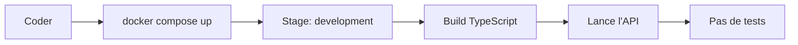
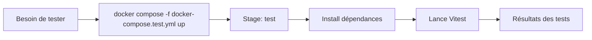
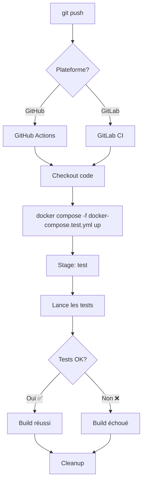
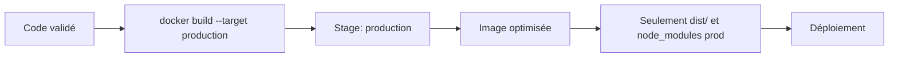

# 🔄 Workflow de Développement

## En local (développement)

**Commande** : `docker compose up --build`
- ✅ Compile le code TypeScript
- ✅ Lance l'API sur localhost:3000
- ❌ Ne lance PAS les tests
- 🔄 Hot reload avec volumes montés

---

## Tests manuels (optionnel)

**Commande** : `docker compose -f docker-compose.test.yml up --build --abort-on-container-exit`
- ✅ Lance la suite de tests complète
- ✅ Utilise une base MongoDB dédiée
- ✅ Nettoie automatiquement après

---

## Push vers GitHub/GitLab (CI/CD)

**Automatique sur** :
- Push vers `main` ou `develop`
- Pull requests / Merge requests

**Ce qui se passe** :
1. Clone le code
2. Build l'image Docker avec le stage `test`
3. Lance MongoDB de test
4. Exécute `pnpm test`
5. Retourne le code de sortie (0 = succès, >0 = échec)
6. Nettoie les conteneurs et volumes

---

## Production (déploiement)

**Commande** : `docker build --target production -t api-samsoul:prod .`
- ✅ Image légère (Alpine)
- ✅ Seulement les dépendances de production
- ✅ Code compilé uniquement (dist/)
- ❌ Pas de devDependencies

---

## 📊 Comparaison des stages

| Stage | Taille | Dépendances | Tests | Usage |
|-------|--------|-------------|-------|-------|
| **development** | ~400MB | Toutes | ❌ | Dev local |
| **test** | ~400MB | Toutes | ✅ | CI/CD |
| **production** | ~150MB | Prod only | ❌ | Déploiement |

---

## 💡 Bonnes pratiques

### En développement
✅ Utilisez `docker compose up` pour le développement quotidien
✅ Les tests sont optionnels en local
✅ Commitez régulièrement pour déclencher les tests CI/CD

### Avant un push important
✅ Lancez les tests localement : `docker compose -f docker-compose.test.yml up`
✅ Vérifiez que tout fonctionne avant de pusher
✅ Les tests CI/CD sont la sécurité finale

### En production
✅ Utilisez le stage `production` uniquement
✅ Configurez correctement `MONGO_URI`
✅ Utilisez des secrets pour les variables sensibles

---

Pour plus d'informations, consultez :
- `README.md` - Documentation générale
- `SETUP_SUMMARY.md` - Détails de la configuration
- `DOCKER_COMMANDS.md` - Référence des commandes

